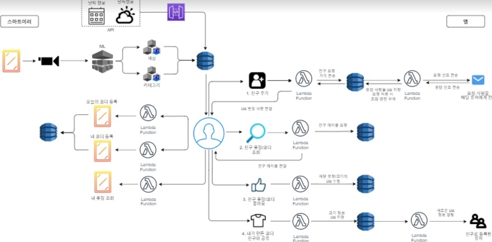

## Between Closet

* IoT/Cloud/AI/Big Data 통합 프로젝트 [프로젝트 Organization 링크](https://github.com/js1342)

* 옷장 관리 및 사용자 간 코디를 공유/추천 받을 수 있는 스마트 옷장 서비스 `Between Closet`

* Between Closet 소개 [PDF](./between_closet.pdf)
  * 파일 용량으로 인해 3분 30초짜리 시연영상을 포함한 PPTX 파일 대신 PDF 업로드

## 개요

* 작업 기간

  * 2020.11.18 ~ 2020.12.24

* 활용 데이터

  * K-Fashion 데이터 (95454장의 이미지 데이터, COCO 형식의 학습용 json 파일)

* 프로젝트 수행 도구

  * Python/Django
* Tensorflow/Keras
  * Vue.js
* Kotlin
  * AWS EC2, RDS, DynamoDB
* Git, [Notion](https://www.notion.so/1342-719338f77d1841d098f69f4eb29a9694), [Figma](https://www.figma.com/file/rHAKGiWJHMW2VWupoJphi1/Untitled?node-id=0%3A1)

* 프로젝트 아키텍처

## AI 파트

#### 1. mmdetection을 활용한 의상 카테고리 분류

* K-fashion Dataset(약 11만장)을 기반으로 스마트 미러 상에서 등록되는 의상의 카테고리 분류

* Mask-RCNN, Faster-RCNN, Hybrid Task Cascade 모델 학습

* mAP 기준으로 성능이 가장 우수한(0.64) Mask-RCNN 사용

#### 2.  OpenCV를 활용한 이미지 추출

* mmdetection에서  도출된 segmentation 포인트 값을 Polygon 형태로 변환

* OpenCV를 활용하여 스마트 미러의 배경색(검정색), 웹앱의 배경색(흰색) 기준으로 

  의상 이미지 crop

#### 3. (1)에서 분류된 이미지를 다시 한 번 색분류

* 어플리케이션 내에서 색 기준으로 카테고라이징 할 수 있도록 색 분류
* CNN, MobileNetV2, DenseNet201, EfficientNet05 모델 학습
* val_accuracy 기준 성능이 가장 우수한(0.86) DenseNet201 사용 

#### 4. Django 웹서버 배포 및 모델을 통과한 의상 정보 및 이미지를 S3에 전송

* 사용하고 있는 EC2를 웹서버로 사용하여 연계하기 위해 Django 사용하여 웹서버 배포

* 이미지 url이 lambda로 수신되면 (1),(2),(3) 과정이 진행되며 의상 분류, 추출, 색분류 진행
* 진행된 결과값(카테고리 분류값, 의상 이미지 경로, 색 분류값)을 AWS S3에 전송

## AI 적용 영상

* 스마트 미러 상에서 등록되는 의상의 카테고리/색 분류 후, 윤곽선을 따라 잘린 의상 이미지가 DB 등록

  미러 상에서 조회 가능

* 웹앱 상에서 DB에 저장된 데이터를 기반으로 의상의 카테고리 및 색 분류 필터를 통해 친구의 의상 조회 가능
  * 더미 데이터를 DB에 집어넣은 후 영상을 촬영한 관계로 모델을 통과하지 않은 데이터 존재...

## 느낀점

#### 프로젝트를 수행하며 어렵거나 아쉬웠던 부분

* 의상 분류 모델의 학습 속도가 생각 외로 느렸고, 

  프로젝트 기획 초기 구상한 데이터 연계 방식에서 수정(greengrass -> http 통신)이 이뤄지면서 

  색 분류 모델의 성능 향상을 위한 시간이 부족했음.

* 웹서버로 연계하다 보니 모델을 그때그때마다 load해야 하는 과정이 생겼고 

  이미지 등록 -> DB 입력까지의  시간이 약 15초 정도 소요.

* 색 분류 모델의 경우, 모델이 주요 feature로 색을 인식하게끔 모델 조정이 필요.

#### 좋았거나 알게 된 부분

* Object Detection 중에서도 Semantic Segmentation을 접할 수 있었음.
* 다른 기술분야의 친구들과 협력하여 하나 통합 프로젝트를 마무리 지었다는 점.
* 통합 프로젝트 수행을 위해 내가 맡은 부분 외에도 다른 기술분야의 이해가 필요하다는 것을 알게 되었음.
* 언제 어떤 부분에서 오류가 발생할지 모르기 때문에 사전 계획을 잘 설정하는 것이 굉장히 중요함을 깨닫게 되었음.